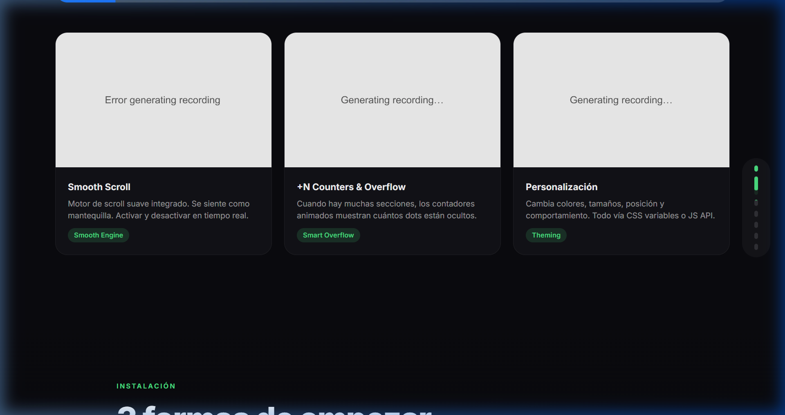
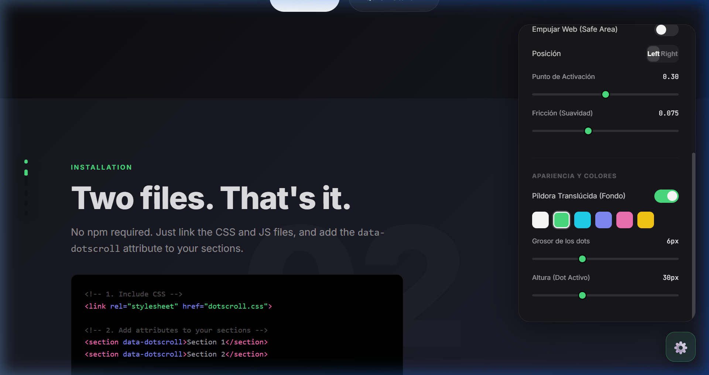

<p align="center">
  <a href="https://lucatorl.github.io/dotscroll/docs/">
    
  </a>
</p>

<h1 align="center">DotScroll</h1>

<p align="center">
  <strong>A lightweight, zero-dependency scroll progress navigation.</strong><br>
  Drop it into any website and get beautiful dot indicators that track your scroll position.
</p>

<p align="center">
  <a href="https://lucatorl.github.io/dotscroll/docs/"><strong>▶ Live Demo</strong></a> ·
  <a href="#-quick-start">Quick Start</a> ·
  <a href="#-customization">Customization</a> ·
  <a href="#%EF%B8%8F-javascript-api">API</a>
</p>

---

## ✨ Features

| Feature | Description |
|---------|-------------|
| 📦 **Zero dependencies** | Pure vanilla JS + CSS, just two files |
| 🎯 **Auto-generates dots** | Add `data-dotscroll` to your sections, done |
| 🧈 **Smooth scrolling** | Built-in Lenis-style smooth scroll engine |
| 📊 **Progress fill** | Active dot fills proportionally as you scroll |
| 🔢 **Smart counters** | Animated odometer shows hidden dots above & below |
| 🎨 **Fully themeable** | CSS custom properties for every visual detail |
| ⌨️ **Keyboard & touch** | Full accessibility and mobile support |
| ⚡ **Scales** | Binary search O(log n), tested with 200+ sections |
| 🪶 **~3KB gzipped** | Tiny footprint, zero bloat |

---

## 🎬 Video Demos

### 1. Basic Scroll Tracking


> Dots automatically track which section is visible and fill proportionally as you scroll down the page.

### 2. Large Scale (Overflow Counters)


> When there are too many sections, animated `+N` counters seamlessly indicate how many dots are hidden outside the viewport.

### 3. Live Customization


> Change colors, sizes, position and behavior — all in real-time. Try it out yourself in the [Live Demo](https://lucatorl.github.io/dotscroll/docs/).

---

## 🚀 Quick Start

### Option A: CDN (Easiest — 2 lines)

```html
<!-- 1. Add CSS to <head> -->
<link rel="stylesheet" href="https://unpkg.com/dotscroll@1.0.0/dist/dotscroll.min.css">

<!-- 2. Mark your sections -->
<section data-dotscroll>Hero</section>
<section data-dotscroll>About</section>
<section data-dotscroll>Contact</section>

<!-- 3. Add JS before </body> -->
<script src="https://unpkg.com/dotscroll@1.0.0/dist/dotscroll.min.js"></script>

<!-- That's it! Auto-initializes ✨ -->
```

### Option B: Download

1. Download `dotscroll.min.js` and `dotscroll.min.css` from the [`dist/`](dist/) folder
2. Add them to your project:

```html
<link rel="stylesheet" href="dotscroll.min.css">
<script src="dotscroll.min.js"></script>
```

3. Add `data-dotscroll` to your sections. **Done.**

### Option C: npm (For bundlers)

```bash
npm install dotscroll
```

```javascript
import DotScroll from 'dotscroll';
import 'dotscroll/dist/dotscroll.min.css';

const ds = DotScroll.init({
  smooth: true,
  position: 'right',
});
```

---

## 🎨 Customization

### CSS Variables

Override these in your stylesheet to theme DotScroll:

```css
:root {
  /* Wrapper */
  --dotscroll-bg: rgba(0, 0, 0, 0.05);
  --dotscroll-blur: 8px;
  --dotscroll-radius: 100px;
  --dotscroll-padding-x: 5px;
  --dotscroll-padding-y: 8px;
  --dotscroll-max-height: 90vh;

  /* Dots */
  --dotscroll-dot-width: 6px;
  --dotscroll-dot-height: 10px;
  --dotscroll-dot-active-height: 30px;
  --dotscroll-dot-gap: 4px;
  --dotscroll-dot-radius: 3px;
  --dotscroll-dot-color: rgba(0, 0, 0, 0.2);
  --dotscroll-dot-hover: rgba(0, 0, 0, 0.35);
  --dotscroll-dot-active-bg: rgba(0, 0, 0, 0.15);
  --dotscroll-fill-color: #000000;

  /* Counters */
  --dotscroll-counter-bg: rgba(255, 255, 255, 0.6);
  --dotscroll-counter-color: #000000;
  --dotscroll-counter-size: 11px;
  --dotscroll-counter-radius: 10px;
  --dotscroll-counter-weight: 800;

  /* Animation */
  --dotscroll-ease: cubic-bezier(0.25, 0.46, 0.45, 0.94);
  --dotscroll-ease-out: cubic-bezier(0.16, 1, 0.3, 1);
}
```

#### Dark Theme Example

```css
:root {
  --dotscroll-bg: rgba(255, 255, 255, 0.06);
  --dotscroll-dot-color: rgba(255, 255, 255, 0.15);
  --dotscroll-dot-hover: rgba(255, 255, 255, 0.3);
  --dotscroll-dot-active-bg: rgba(255, 255, 255, 0.1);
  --dotscroll-fill-color: #ffffff;
  --dotscroll-counter-bg: rgba(255, 255, 255, 0.1);
  --dotscroll-counter-color: rgba(255, 255, 255, 0.8);
}
```

### Script Tag Attributes

Configure behavior without writing JavaScript:

```html
<script src="dotscroll.min.js"
  data-smooth="true"
  data-position="right"
  data-offset="24"
  data-ease="0.075"
  data-triggeroffset="0.3"
  data-hidescrollbar="true"
></script>
```

| Attribute | Type | Default | Description |
|-----------|------|---------|-------------|
| `data-smooth` | boolean | `true` | Enable smooth scrolling |
| `data-position` | string | `"right"` | `"left"` or `"right"` |
| `data-offset` | number | `24` | Distance from viewport edge (px) |
| `data-ease` | number | `0.075` | Smooth scroll easing (0-1) |
| `data-triggeroffset` | number | `0.3` | Viewport fraction that triggers section change |
| `data-hidescrollbar` | boolean | `true` | Hide native scrollbar |
| `data-auto-init` | boolean | `true` | Set `false` to disable auto-initialization |

### Section Labels

Add accessible labels to individual dots:

```html
<section data-dotscroll data-dotscroll-label="Home">...</section>
<section data-dotscroll data-dotscroll-label="About Us">...</section>
```

---

## ⚙️ JavaScript API

For advanced usage, initialize manually:

```html
<script src="dotscroll.min.js" data-auto-init="false"></script>
<script>
  const ds = DotScroll.init({
    selector: '[data-dotscroll]',
    smooth: true,
    ease: 0.075,
    position: 'right',
    offset: 24,
    triggerOffset: 0.3,
    hideScrollbar: true,
    invert: false,
    compact: false,
    pushBody: false,
    onChange: (index, sectionElement, previousIndex) => {
      console.log('Now viewing section', index);
    }
  });
</script>
```

### Instance Methods

| Method | Description |
|--------|-------------|
| `ds.scrollTo(index)` | Scroll to a section by index (0-based) |
| `ds.getActiveIndex()` | Returns the current active section index |
| `ds.getActiveSection()` | Returns the current active section element |
| `ds.setSmooth(true/false)` | Enable or disable smooth scrolling at runtime |
| `ds.refresh()` | Recalculate layout (call after DOM changes) |
| `ds.destroy()` | Remove everything and clean up |

### Static Methods

| Method | Description |
|--------|-------------|
| `DotScroll.init(options)` | Create a new instance (factory) |
| `DotScroll.destroyAll()` | Destroy all instances |
| `DotScroll.defaults` | Read the default options |

### All Options

| Option | Type | Default | Description |
|--------|------|---------|-------------|
| `selector` | string | `"[data-dotscroll]"` | CSS selector for tracked sections |
| `smooth` | boolean | `true` | Enable smooth scrolling |
| `ease` | number | `0.075` | Smooth scroll friction (0-1, lower = smoother) |
| `position` | string | `"right"` | `"left"` or `"right"` |
| `offset` | number | `24` | Distance from viewport edge (px) |
| `triggerOffset` | number | `0.3` | Viewport fraction that triggers section change |
| `hideScrollbar` | boolean | `true` | Hide native scrollbar when smooth is on |
| `invert` | boolean | `false` | High contrast mode via mix-blend-mode |
| `compact` | boolean | `false` | Hide the translucent pill background |
| `pushBody` | boolean | `false` | Inject CSS variables to push content away |
| `onChange` | function | `null` | Callback: `(index, element, prevIndex) => {}` |

---

## 📁 Project Structure

```text
dotscroll/
├── dist/                    ← Distribution files (use these)
│   ├── dotscroll.js         
│   ├── dotscroll.min.js     
│   ├── dotscroll.css        
│   └── dotscroll.min.css    
│
├── src/                     ← Source code
│   ├── dotscroll.js         
│   └── dotscroll.css        
│
├── docs/                    ← Live Demo directory (GitHub Pages)
│   ├── index.html           
│   └── demo.css
│
├── assets/                  ← README assets
│   ├── demo_basica.webp
│   ├── demo_multiples.png
│   └── demo_ajustes.png
│
├── package.json             ← npm package config
├── build.js                 ← Build script
└── README.md
```

---

## 📐 How It Works

1. **Sections** — Any element with `data-dotscroll` becomes a tracked section
2. **Dots** — Auto-generated in a fixed sidebar, one per section
3. **Progress** — As you scroll through a section, its dot fills from top to bottom
4. **Active** — Binary search (O(log n)) finds the active section efficiently
5. **Counters** — When dots overflow the viewport, animated `+N` counters show how many are hidden
6. **Smooth** — Optional smooth scrolling intercepts wheel/touch/keyboard events

---

## 🌐 Browser Support

| Browser | Version |
|---------|---------|
| Chrome | 60+ |
| Firefox | 55+ |
| Safari | 12+ |
| Edge | 79+ |
| iOS Safari | 12+ |
| Android Chrome | 60+ |

---

## 📄 License

MIT — free for personal and commercial use.

---

<p align="center">
  Made with ☕
</p>
